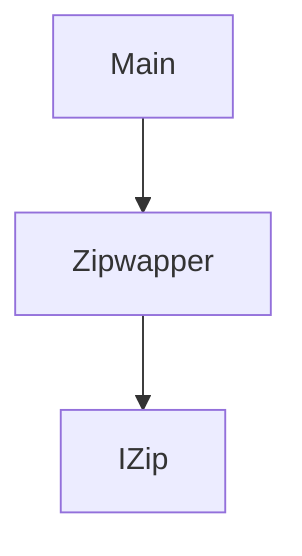

# 基本介绍
这是一个简单的C++ 可执行工具，能够用多线程的方式去解压一个文件。

# 使用方法
```
 ./MutiThreadZiper <zipfile> <output Path> 
 ```

# 代码基本结构


# 安装依赖

```bash
brew install libzip
```

# 如何去编译

使用xcode 直接编译
```bash
```

# 测试结果
Mac 测试结果
```
Mac 环境: MacBook Pro Intel 13.5 
测试命令: ./MutiThreadZiper /Users/chengjzh/Documents/wme-ta-sst-master.zip  /Users/chengjzh/Documents/wme
结果: 
2023-09-05 14:51:06.119 Path created: /Users/chengjzh/Documents/wme
Zip file has 267 entry
2023-09-05 14:51:06.481 ####Error creating output file:/Users/chengjzh/Documents/wme/wme-ta-sst-master/.dvc/.gitignore
2023-09-05 14:51:06.636 Path created: /Users/chengjzh/Documents/wme/wme-ta-sst-master/
2023-09-05 14:51:06.761 Path created: /Users/chengjzh/Documents/wme/wme-ta-sst-master/.dvc/
2023-09-05 14:51:06.016 Path created: /Users/chengjzh/Documents/wme/wme-ta-sst-master/.dvc/plots/
2023-09-05 14:51:06.141 thread 2 Extracted: wme-ta-sst-master/.dvc/config
2023-09-05 14:51:06.315 thread 1 Extracted: wme-ta-sst-master/.dvc/plots/confusion.json
2023-09-05 14:51:06.572 thread 0 Extracted: wme-ta-sst-master/.dvc/plots/confusion_normalized.json
2023-09-05 14:51:06.688 thread 2 Extracted: wme-ta-sst-master/.dvc/plots/default.json
2023-09-05 14:51:06.863 thread 1 Extracted: wme-ta-sst-master/.dvc/plots/linear.json
2023-09-05 14:51:06.061 thread 0 Extracted: wme-ta-sst-master/.dvc/plots/scatter.json
2023-09-05 14:51:06.160 thread 2 Extracted: wme-ta-sst-master/.dvc/plots/smooth.json
2023-09-05 14:51:06.265 thread 1 Extracted: wme-ta-sst-master/.dvcignore
2023-09-05 14:51:06.396 thread 0 Extracted: wme-ta-sst-master/.gitignore
2023-09-05 14:51:06.644 Path created: /Users/chengjzh/Documents/wme/wme-ta-sst-master/data/
2023-09-05 14:51:07.569 thread 2 Extracted: wme-ta-sst-master/Readme.md
2023-09-05 14:51:07.657 thread 0 Extracted: wme-ta-sst-master/data/.gitignore
2023-09-05 14:51:07.990 thread 1 Extracted: wme-ta-sst-master/data/audio_aec.dvc
2023-09-05 14:51:07.118 thread 2 Extracted: wme-ta-sst-master/data/audio_agc.dvc
2023-09-05 14:51:07.209 thread 0 Extracted: wme-ta-sst-master/data/audio_bnr.dvc
2023-09-05 14:51:07.549 thread 1 Extracted: wme-ta-sst-master/data/audio_codecencode.dvc
2023-09-05 14:51:07.671 thread 2 Extracted: wme-ta-sst-master/data/audio_jitterbuffer.dvc
2023-09-05 14:51:07.781 thread 0 Extracted: wme-ta-sst-master/data/audio_playback.dvc
2023-09-05 14:51:07.117 thread 1 Extracted: wme-ta-sst-master/data/debug_test.dvc
2023-09-05 14:51:07.196 thread 2 Extracted: wme-ta-sst-master/data/new_aec.dvc
2023-09-05 14:51:07.415 thread 0 Extracted: wme-ta-sst-master/data/share_capture.dvc
2023-09-05 14:51:07.609 thread 1 Extracted: wme-ta-sst-master/data/share_content.dvc
2023-09-05 14:51:07.658 thread 2 Extracted: wme-ta-sst-master/data/simulator_resource.dvc
2023-09-05 14:51:07.791 thread 0 Extracted: wme-ta-sst-master/data/super_resolution.dvc
2023-09-05 14:51:07.115 thread 0 Extracted: wme-ta-sst-master/data/video_codecencode.dvc
2023-09-05 14:51:07.235 thread 2 Extracted: wme-ta-sst-master/data/video_capture.dvc
2023-09-05 14:51:07.296 thread 1 Extracted: wme-ta-sst-master/data/video_adjust.dvc
2023-09-05 14:51:07.558 thread 0 Extracted: wme-ta-sst-master/data/video_colorboost.dvc
2023-09-05 14:51:07.647 thread 2 Extracted: wme-ta-sst-master/data/video_denoise.dvc
2023-09-05 14:51:07.807 thread 1 Extracted: wme-ta-sst-master/data/video_gesture.dvc
2023-09-05 14:51:07.956 thread 0 Extracted: wme-ta-sst-master/data/video_vbg.dvc
2023-09-05 14:51:07.162 thread 2 Extracted: wme-ta-sst-master/requirements.txt
2023-09-05 14:51:07.302 Path created: /Users/chengjzh/Documents/wme/wme-ta-sst-master/scripts/
2023-09-05 14:51:07.381 thread 1 Extracted: wme-ta-sst-master/requirements_win.txt
2023-09-05 14:51:07.549 Path created: /Users/chengjzh/Documents/wme/wme-ta-sst-master/scripts/common/
2023-09-05 14:51:07.893 thread 1 Extracted: wme-ta-sst-master/scripts/common/log.py
2023-09-05 14:51:07.229 thread 0 Extracted: wme-ta-sst-master/scripts/common/common.py
2023-09-05 14:51:07.359 thread 2 Extracted: wme-ta-sst-master/scripts/common/mpthreadManager.py
2023-09-05 14:51:07.658 thread 0 Extracted: wme-ta-sst-master/scripts/common/utils.py
2023-09-05 14:51:07.802 thread 1 Extracted: wme-ta-sst-master/scripts/common/rpccommon.py
2023-09-05 14:51:07.898 thread 2 Extracted: wme-ta-sst-master/scripts/config.json
2023-09-05 14:51:07.016 Path created: /Users/chengjzh/Documents/wme/wme-ta-sst-master/scripts/core/
2023-09-05 14:51:07.619 thread 1 Extracted: wme-ta-sst-master/scripts/core/dynamic_func.py
2023-09-05 14:51:07.720 thread 2 Extracted: wme-ta-sst-master/scripts/core/generateCase.py
2023-09-05 14:51:07.846 thread 0 Extracted: wme-ta-sst-master/scripts/core/generateJson.py
2023-09-05 14:51:07.351 thread 1 Extracted: wme-ta-sst-master/scripts/core/generateTable.py
2023-09-05 14:51:07.453 thread 0 Extracted: wme-ta-sst-master/scripts/core/mptsingleprocess.py
2023-09-05 14:51:07.558 thread 2 Extracted: wme-ta-sst-master/scripts/core/generate_instance.py
2023-09-05 14:51:07.333 Path created: /Users/chengjzh/Documents/wme/wme-ta-sst-master/scripts/lib/
2023-09-05 14:51:07.555 thread 0 Extracted: wme-ta-sst-master/scripts/lib/csvcontroller.py
2023-09-05 14:51:07.717 Path created: /Users/chengjzh/Documents/wme/wme-ta-sst-master/scripts/model/
2023-09-05 14:51:07.134 thread 0 Extracted: wme-ta-sst-master/scripts/model/audio_aec.py
2023-09-05 14:51:07.319 thread 1 Extracted: wme-ta-sst-master/scripts/model/android_adb.py
2023-09-05 14:51:07.495 thread 2 Extracted: wme-ta-sst-master/scripts/model/audio_agc.py
2023-09-05 14:51:07.750 thread 0 Extracted: wme-ta-sst-master/scripts/model/audio_bnr.py
2023-09-05 14:51:07.496 thread 2 Extracted: wme-ta-sst-master/scripts/model/ios_deploy.py
2023-09-05 14:51:07.688 thread 0 Extracted: wme-ta-sst-master/scripts/model/video_vbg.py
2023-09-05 14:51:07.242 thread 2 Extracted: wme-ta-sst-master/scripts/run.py
2023-09-05 14:51:07.802 thread 1 Extracted: wme-ta-sst-master/scripts/model/case_result.py
2023-09-05 14:51:07.990 thread 0 Extracted: wme-ta-sst-master/scripts/run_ta.py
2023-09-05 14:51:07.311 Path created: /Users/chengjzh/Documents/wme/wme-ta-sst-master/ta/
2023-09-05 14:51:07.577 thread 1 Extracted: wme-ta-sst-master/scripts/util.py
2023-09-05 14:51:07.678 Path created: /Users/chengjzh/Documents/wme/wme-ta-sst-master/ta/audio_aec/
2023-09-05 14:51:07.949 thread 2 Extracted: wme-ta-sst-master/scripts/test.py
2023-09-05 14:51:07.110 thread 1 Extracted: wme-ta-sst-master/ta/audio_aec/audio_aec_perf_temp.json
2023-09-05 14:51:07.232 thread 0 Extracted: wme-ta-sst-master/ta/audio_aec/audio_aec_quality_android.json
2023-09-05 14:51:07.566 thread 1 Extracted: wme-ta-sst-master/ta/audio_aec/audio_aec_quality_temp.json
2023-09-05 14:51:07.813 thread 2 Extracted: wme-ta-sst-master/ta/audio_aec/audio_aec_quality_ios.json
2023-09-05 14:51:07.151 thread 0 Extracted: wme-ta-sst-master/ta/audio_aec/audio_aecbnr_quality_android.json
2023-09-05 14:51:07.345 thread 1 Extracted: wme-ta-sst-master/ta/audio_aec/audio_aecbnr_quality_ios.json
2023-09-05 14:51:07.576 thread 2 Extracted: wme-ta-sst-master/ta/audio_aec/audio_aeclinear_quality_android.json
2023-09-05 14:51:07.676 Path created: /Users/chengjzh/Documents/wme/wme-ta-sst-master/ta/audio_agc/
2023-09-05 14:51:07.793 thread 0 Extracted: wme-ta-sst-master/ta/audio_aec/audio_aeclinear_quality_ios.json
2023-09-05 14:51:07.030 thread 2 Extracted: wme-ta-sst-master/ta/audio_agc/audio_agc_perf_desktopOnlyBNR.json
2023-09-05 14:51:07.353 thread 1 Extracted: wme-ta-sst-master/ta/audio_agc/audio_agc_perf_desktopOnlyDAGC.json
2023-09-05 14:51:07.528 thread 0 Extracted: wme-ta-sst-master/ta/audio_agc/audio_agc_perf_desktopOnlyPostDAGC.json
2023-09-05 14:51:07.723 thread 2 Extracted: wme-ta-sst-master/ta/audio_agc/audio_agc_perf_mobileSTAll.json
2023-09-05 14:51:07.913 thread 1 Extracted: wme-ta-sst-master/ta/audio_agc/audio_agc_perf_mobileSTOnlyBNR.json
2023-09-05 14:51:07.232 thread 2 Extracted: wme-ta-sst-master/ta/audio_agc/audio_agc_quality_androidST.json
2023-09-05 14:51:07.359 thread 0 Extracted: wme-ta-sst-master/ta/audio_agc/audio_agc_quality_android.json
2023-09-05 14:51:07.800 thread 1 Extracted: wme-ta-sst-master/ta/audio_agc/audio_agc_quality_gatingAndroid.json
2023-09-05 14:51:07.000 thread 0 Extracted: wme-ta-sst-master/ta/audio_agc/audio_agc_quality_gatingDesktop.json
2023-09-05 14:51:07.136 thread 2 Extracted: wme-ta-sst-master/ta/audio_agc/audio_agc_quality_gatingIOS.json
2023-09-05 14:51:07.605 thread 1 Extracted: wme-ta-sst-master/ta/audio_agc/audio_agc_quality_ios.json
2023-09-05 14:51:07.719 thread 0 Extracted: wme-ta-sst-master/ta/audio_agc/audio_agc_quality_iosST.json
2023-09-05 14:51:07.896 Path created: /Users/chengjzh/Documents/wme/wme-ta-sst-master/ta/audio_bnr/
2023-09-05 14:51:07.139 thread 0 Extracted: wme-ta-sst-master/ta/audio_bnr/audio_bnr_perf_temp.json
2023-09-05 14:51:07.225 thread 2 Extracted: wme-ta-sst-master/ta/audio_agc/audio_agc_quality_temp.json
2023-09-05 14:51:07.318 thread 1 Extracted: wme-ta-sst-master/ta/audio_bnr/audio_bnr_quality_corner.json
2023-09-05 14:51:07.532 thread 0 Extracted: wme-ta-sst-master/ta/audio_bnr/audio_bnr_quality_gating.json
2023-09-05 14:51:07.676 thread 2 Extracted: wme-ta-sst-master/ta/audio_bnr/audio_bnr_quality_normal.json
2023-09-05 14:51:07.781 Path created: /Users/chengjzh/Documents/wme/wme-ta-sst-master/ta/audio_capture/
2023-09-05 14:51:07.854 thread 1 Extracted: wme-ta-sst-master/ta/audio_bnr/audio_bnr_quality_temp.json
2023-09-05 14:51:07.196 Path created: /Users/chengjzh/Documents/wme/wme-ta-sst-master/ta/audio_codecencode/
2023-09-05 14:51:07.290 thread 2 Extracted: wme-ta-sst-master/ta/audio_capture/audio_capture_func_temp.json
2023-09-05 14:51:07.470 Path created: /Users/chengjzh/Documents/wme/wme-ta-sst-master/ta/audio_jitterbuffer/
2023-09-05 14:51:07.578 thread 1 Extracted: wme-ta-sst-master/ta/audio_codecencode/audio_codecencode_perf_temp.json
2023-09-05 14:51:07.700 Path created: /Users/chengjzh/Documents/wme/wme-ta-sst-master/ta/audio_playback/
2023-09-05 14:51:07.797 thread 2 Extracted: wme-ta-sst-master/ta/audio_jitterbuffer/audio_jitterbuffer_func_temp.json
2023-09-05 14:51:07.941 Path created: /Users/chengjzh/Documents/wme/wme-ta-sst-master/ta/conf/
2023-09-05 14:51:07.018 thread 1 Extracted: wme-ta-sst-master/ta/audio_playback/audio_playback_func_temp.json
2023-09-05 14:51:07.345 thread 0 Extracted: wme-ta-sst-master/ta/conf/module_code_mapping.json
2023-09-05 14:51:07.446 thread 1 Extracted: wme-ta-sst-master/ta/conf/resource_config.json
2023-09-05 14:51:07.549 thread 2 Extracted: wme-ta-sst-master/ta/conf/case_config.json
2023-09-05 14:51:07.700 Path created: /Users/chengjzh/Documents/wme/wme-ta-sst-master/ta/debug_test/
2023-09-05 14:51:07.785 thread 0 Extracted: wme-ta-sst-master/ta/conf/test_case_config.json
2023-09-05 14:51:07.895 Path created: /Users/chengjzh/Documents/wme/wme-ta-sst-master/ta/debug_test/aec/
2023-09-05 14:51:07.169 Path created: /Users/chengjzh/Documents/wme/wme-ta-sst-master/ta/debug_test/aec/clean/
2023-09-05 14:51:07.244 thread 0 Extracted: wme-ta-sst-master/ta/debug_test/aec/aec_joint_nlp.json
2023-09-05 14:51:07.335 thread 1 Extracted: wme-ta-sst-master/ta/debug_test/aec/aec_bbl_nlp.json
2023-09-05 14:51:07.560 Path created: /Users/chengjzh/Documents/wme/wme-ta-sst-master/ta/debug_test/aec/mingyang_1/
2023-09-05 14:51:07.671 thread 2 Extracted: wme-ta-sst-master/ta/debug_test/aec/clean/mpt.json
2023-09-05 14:51:07.984 thread 0 Extracted: wme-ta-sst-master/ta/debug_test/aec/mingyang_1/mpt.json
2023-09-05 14:51:07.159 thread 1 Extracted: wme-ta-sst-master/ta/debug_test/aec/mingyang_1/mpt-perf.json
2023-09-05 14:51:07.388 thread 2 Extracted: wme-ta-sst-master/ta/debug_test/aec/mingyang_1/mpt_disable_aec_no_nlp.json
2023-09-05 14:51:07.316 thread 0 Extracted: wme-ta-sst-master/ta/debug_test/aec/mingyang_1/mpt_disable_aec_nr.json
2023-09-05 14:51:07.730 thread 2 Extracted: wme-ta-sst-master/ta/debug_test/audio_aagc/aagc_classic.json
2023-09-05 14:51:07.987 Path created: /Users/chengjzh/Documents/wme/wme-ta-sst-master/ta/debug_test/audio_aagc/
2023-09-05 14:51:07.107 thread 0 Extracted: wme-ta-sst-master/ta/debug_test/audio_aagc/aagc_improve.json
2023-09-05 14:51:07.287 thread 2 Extracted: wme-ta-sst-master/ta/debug_test/audio_aagc/aagc_new_agc.json
2023-09-05 14:51:07.461 Path created: /Users/chengjzh/Documents/wme/wme-ta-sst-master/ta/debug_test/audio_aec/
2023-09-05 14:51:07.691 thread 1 Extracted: wme-ta-sst-master/ta/debug_test/audio_aagc/test.json
2023-09-05 14:51:07.833 Path created: /Users/chengjzh/Documents/wme/wme-ta-sst-master/ta/debug_test/audio_agc/
2023-09-05 14:51:07.002 thread 2 Extracted: wme-ta-sst-master/ta/debug_test/audio_aec/ta_eval_template.json
2023-09-05 14:51:07.287 thread 0 Extracted: wme-ta-sst-master/ta/debug_test/audio_agc/test_mobile_agc.json
2023-09-05 14:51:07.372 Path created: /Users/chengjzh/Documents/wme/wme-ta-sst-master/ta/debug_test/audio_bnr/
2023-09-05 14:51:07.623 thread 1 Extracted: wme-ta-sst-master/ta/debug_test/audio_agc/test_aagc.json
2023-09-05 14:51:07.875 thread 0 Extracted: wme-ta-sst-master/ta/debug_test/audio_bnr/audio_bnr_performance.json
2023-09-05 14:51:07.087 thread 2 Extracted: wme-ta-sst-master/ta/debug_test/audio_bnr/mpt_noise_clear.json
2023-09-05 14:51:07.206 thread 1 Extracted: wme-ta-sst-master/ta/debug_test/audio_bnr/mpt_noise_only.json
2023-09-05 14:51:07.315 thread 0 Extracted: wme-ta-sst-master/ta/debug_test/audio_bnr/mpt_perf.json
2023-09-05 14:51:07.508 Path created: /Users/chengjzh/Documents/wme/wme-ta-sst-master/ta/debug_test/audio_capture/
2023-09-05 14:51:07.682 thread 0 Extracted: wme-ta-sst-master/ta/debug_test/audio_capture/mpt.json
2023-09-05 14:51:07.819 thread 2 Extracted: wme-ta-sst-master/ta/debug_test/audio_bnr/mpt_single_talk.json
2023-09-05 14:51:07.935 thread 1 Extracted: wme-ta-sst-master/ta/debug_test/audio_capture/mpt_device_usable.json
2023-09-05 14:51:07.112 ####Error creating output file:/Users/chengjzh/Documents/wme/wme-ta-sst-master/ta/debug_test/audio_codecencode/opus_decode.json
2023-09-05 14:51:07.483 Path created: /Users/chengjzh/Documents/wme/wme-ta-sst-master/ta/debug_test/audio_codecencode/
2023-09-05 14:51:07.640 Path created: /Users/chengjzh/Documents/wme/wme-ta-sst-master/ta/debug_test/audio_dagc/
2023-09-05 14:51:07.892 thread 1 Extracted: wme-ta-sst-master/ta/debug_test/audio_codecencode/opus_encode.json
2023-09-05 14:51:07.178 thread 0 Extracted: wme-ta-sst-master/ta/debug_test/audio_dagc/dagc_perf.json
2023-09-05 14:51:07.342 Path created: /Users/chengjzh/Documents/wme/wme-ta-sst-master/ta/debug_test/audio_jitterbuffer/
2023-09-05 14:51:07.506 Path created: /Users/chengjzh/Documents/wme/wme-ta-sst-master/ta/debug_test/audio_jitterbuffer/input/
2023-09-05 14:51:07.649 thread 1 Extracted: wme-ta-sst-master/ta/debug_test/audio_jitterbuffer/audio_jitterbuffer_func_temp.json
2023-09-05 14:51:07.971 Path created: /Users/chengjzh/Documents/wme/wme-ta-sst-master/ta/debug_test/audio_multi_talker/
2023-09-05 14:51:07.322 thread 0 Extracted: wme-ta-sst-master/ta/debug_test/audio_jitterbuffer/mpt_audio_jitterbuffer.json
2023-09-05 14:51:07.642 thread 1 Extracted: wme-ta-sst-master/ta/debug_test/audio_multi_talker/multi_talker-new-agc.json
2023-09-05 14:51:07.831 thread 0 Extracted: wme-ta-sst-master/ta/debug_test/audio_multi_talker/multi_talker.json
2023-09-05 14:51:07.211 thread 1 Extracted: wme-ta-sst-master/ta/debug_test/audio_multi_talker/test.json
2023-09-05 14:51:07.497 Path created: /Users/chengjzh/Documents/wme/wme-ta-sst-master/ta/debug_test/audio_pipeline/
2023-09-05 14:51:07.708 thread 1 Extracted: wme-ta-sst-master/ta/debug_test/audio_pipeline/audio_pipeline_production.json
2023-09-05 14:51:07.892 Path created: /Users/chengjzh/Documents/wme/wme-ta-sst-master/ta/debug_test/audio_playback/
2023-09-05 14:51:07.161 thread 1 Extracted: wme-ta-sst-master/ta/debug_test/audio_playback/mpt_device_playback.json
2023-09-05 14:51:07.537 Path created: /Users/chengjzh/Documents/wme/wme-ta-sst-master/ta/debug_test/audio_simulator/
2023-09-05 14:51:07.591 thread 1 Extracted: wme-ta-sst-master/ta/debug_test/audio_simulator/test_volume_adjust_simulator.json
2023-09-05 14:51:07.903 Path created: /Users/chengjzh/Documents/wme/wme-ta-sst-master/ta/debug_test/audio_single_talker/
2023-09-05 14:51:07.327 thread 1 Extracted: wme-ta-sst-master/ta/debug_test/audio_single_talker/disable_single_talker.json
2023-09-05 14:51:07.477 thread 0 Extracted: wme-ta-sst-master/ta/debug_test/audio_playback/mpt_file_playback.json
2023-09-05 14:51:07.903 thread 1 Extracted: wme-ta-sst-master/ta/debug_test/audio_single_talker/single_talker-new-agc.json
2023-09-05 14:51:07.010 thread 0 Extracted: wme-ta-sst-master/ta/debug_test/audio_single_talker/single_talker.json
2023-09-05 14:51:07.390 Path created: /Users/chengjzh/Documents/wme/wme-ta-sst-master/ta/debug_test/grand_aec/
2023-09-05 14:51:07.680 thread 0 Extracted: wme-ta-sst-master/ta/debug_test/grand_aec/triple_dump.json
2023-09-05 14:51:07.789 Path created: /Users/chengjzh/Documents/wme/wme-ta-sst-master/ta/debug_test/room_simulator/
2023-09-05 14:51:07.259 thread 0 Extracted: wme-ta-sst-master/ta/debug_test/room_simulator/test_matlab_bridge_with_3_channel.json
2023-09-05 14:51:07.473 thread 1 Extracted: wme-ta-sst-master/ta/debug_test/room_simulator/test_mpt_simulator_aec.json
2023-09-05 14:51:07.623 Path created: /Users/chengjzh/Documents/wme/wme-ta-sst-master/ta/debug_test/rpc/
2023-09-05 14:51:07.889 thread 1 Extracted: wme-ta-sst-master/ta/debug_test/rpc/mpt.json
2023-09-05 14:51:07.996 Path created: /Users/chengjzh/Documents/wme/wme-ta-sst-master/ta/debug_test/share_capture/
2023-09-05 14:51:07.378 thread 1 Extracted: wme-ta-sst-master/ta/debug_test/share_capture/mpt_appshare.json
2023-09-05 14:51:07.716 Path created: /Users/chengjzh/Documents/wme/wme-ta-sst-master/ta/debug_test/share_contentdetection/
2023-09-05 14:51:07.791 thread 0 Extracted: wme-ta-sst-master/ta/debug_test/share_capture/mpt_share_desktop.json
2023-09-05 14:51:07.130 Path created: /Users/chengjzh/Documents/wme/wme-ta-sst-master/ta/debug_test/share_pipeline/
2023-09-05 14:51:07.318 thread 1 Extracted: wme-ta-sst-master/ta/debug_test/share_contentdetection/testContentDetection.json
2023-09-05 14:51:07.443 thread 0 Extracted: wme-ta-sst-master/ta/debug_test/share_pipeline/share_pipeline_production.json
2023-09-05 14:51:07.743 Path created: /Users/chengjzh/Documents/wme/wme-ta-sst-master/ta/debug_test/template/
2023-09-05 14:51:07.899 thread 0 Extracted: wme-ta-sst-master/ta/debug_test/template/mpt.json.template
2023-09-05 14:51:07.207 thread 1 Extracted: wme-ta-sst-master/ta/debug_test/test.json
2023-09-05 14:51:07.403 thread 0 Extracted: wme-ta-sst-master/ta/debug_test/test_audio_codec.json
2023-09-05 14:51:07.702 thread 1 Extracted: wme-ta-sst-master/ta/debug_test/test_external_module.json
2023-09-05 14:51:07.794 thread 0 Extracted: wme-ta-sst-master/ta/debug_test/test_matlab_bridge_dll.json
2023-09-05 14:51:07.130 thread 1 Extracted: wme-ta-sst-master/ta/debug_test/test_matlab_bridge_script.json
2023-09-05 14:51:07.216 thread 0 Extracted: wme-ta-sst-master/ta/debug_test/test_media_session.json
2023-09-05 14:51:07.413 Path created: /Users/chengjzh/Documents/wme/wme-ta-sst-master/ta/debug_test/thread/
2023-09-05 14:51:07.615 thread 0 Extracted: wme-ta-sst-master/ta/debug_test/thread/mpt_thread.json
2023-09-05 14:51:07.707 Path created: /Users/chengjzh/Documents/wme/wme-ta-sst-master/ta/debug_test/video_ai_content_detection/
2023-09-05 14:51:07.989 Path created: /Users/chengjzh/Documents/wme/wme-ta-sst-master/ta/debug_test/video_capture/
2023-09-05 14:51:07.080 thread 0 Extracted: wme-ta-sst-master/ta/debug_test/video_ai_content_detection/video_ai_content_detection.json
2023-09-05 14:51:07.266 thread 1 Extracted: wme-ta-sst-master/ta/debug_test/video_capture/mpt.json
2023-09-05 14:51:07.530 thread 0 Extracted: wme-ta-sst-master/ta/debug_test/video_capture/mpt_device_usable.json
2023-09-05 14:51:07.609 Path created: /Users/chengjzh/Documents/wme/wme-ta-sst-master/ta/debug_test/video_codec/
2023-09-05 14:51:07.064 thread 0 Extracted: wme-ta-sst-master/ta/debug_test/video_codec/av1_codec.json
2023-09-05 14:51:07.178 thread 1 Extracted: wme-ta-sst-master/ta/debug_test/video_codec/av1_decode.json
2023-09-05 14:51:07.497 thread 0 Extracted: wme-ta-sst-master/ta/debug_test/video_codec/av1_encode.json
2023-09-05 14:51:07.586 thread 1 Extracted: wme-ta-sst-master/ta/debug_test/video_codec/h264_codec.json
2023-09-05 14:51:07.906 thread 0 Extracted: wme-ta-sst-master/ta/debug_test/video_codec/h264_decode.json
2023-09-05 14:51:07.989 thread 1 Extracted: wme-ta-sst-master/ta/debug_test/video_codec/h264_encode.json
2023-09-05 14:51:07.336 thread 0 Extracted: wme-ta-sst-master/ta/debug_test/video_codec/video_codec_AV1.json
2023-09-05 14:51:07.429 thread 1 Extracted: wme-ta-sst-master/ta/debug_test/video_codec/video_codec_func_temp.json
2023-09-05 14:51:07.769 thread 0 Extracted: wme-ta-sst-master/ta/debug_test/video_codec/video_codec_h264.json
2023-09-05 14:51:07.948 Path created: /Users/chengjzh/Documents/wme/wme-ta-sst-master/ta/debug_test/video_gesture/
2023-09-05 14:51:07.183 thread 0 Extracted: wme-ta-sst-master/ta/debug_test/video_gesture/gesture_thumb_up_down_clap.json
2023-09-05 14:51:07.521 Path created: /Users/chengjzh/Documents/wme/wme-ta-sst-master/ta/debug_test/video_pipeline/
2023-09-05 14:51:07.649 thread 1 Extracted: wme-ta-sst-master/ta/debug_test/video_gesture/mpt.json
2023-09-05 14:51:07.861 thread 0 Extracted: wme-ta-sst-master/ta/debug_test/video_pipeline/video_pipeline_production.json
2023-09-05 14:51:07.988 Path created: /Users/chengjzh/Documents/wme/wme-ta-sst-master/ta/debug_test/video_processing/
2023-09-05 14:51:07.252 thread 0 Extracted: wme-ta-sst-master/ta/debug_test/video_processing/video_process_content_detection.json
2023-09-05 14:51:07.342 thread 1 Extracted: wme-ta-sst-master/ta/debug_test/video_processing/video_process_csc.json
2023-09-05 14:51:07.714 thread 0 Extracted: wme-ta-sst-master/ta/debug_test/video_processing/video_process_denoise.json
2023-09-05 14:51:07.798 thread 1 Extracted: wme-ta-sst-master/ta/debug_test/video_processing/video_process_downSample.json
2023-09-05 14:51:07.107 thread 0 Extracted: wme-ta-sst-master/ta/debug_test/video_processing/video_process_lcboost.json
2023-09-05 14:51:07.207 thread 1 Extracted: wme-ta-sst-master/ta/debug_test/video_processing/video_process_manual_image_adjust.json
2023-09-05 14:51:07.465 Path created: /Users/chengjzh/Documents/wme/wme-ta-sst-master/ta/debug_test/video_render/
2023-09-05 14:51:07.560 thread 0 Extracted: wme-ta-sst-master/ta/debug_test/video_processing/video_process_super_resolution.json
2023-09-05 14:51:07.832 thread 1 Extracted: wme-ta-sst-master/ta/debug_test/video_render/video_render_file.json
2023-09-05 14:51:07.936 thread 0 Extracted: wme-ta-sst-master/ta/debug_test/video_render/video_render_share.json
2023-09-05 14:51:07.075 Path created: /Users/chengjzh/Documents/wme/wme-ta-sst-master/ta/debug_test/video_vbr/
2023-09-05 14:51:07.375 thread 0 Extracted: wme-ta-sst-master/ta/debug_test/video_vbr/video_vbg_with_file.json
2023-09-05 14:51:07.499 thread 1 Extracted: wme-ta-sst-master/ta/debug_test/video_vbr/video_vbg_with_video.json
2023-09-05 14:51:07.759 Path created: /Users/chengjzh/Documents/wme/wme-ta-sst-master/ta/new_aec/
2023-09-05 14:51:07.831 thread 0 Extracted: wme-ta-sst-master/ta/debug_test/video_vbr/video_vbr_with_camera.json
2023-09-05 14:51:07.394 thread 1 Extracted: wme-ta-sst-master/ta/new_aec/new_aec_perf_android.json
2023-09-05 14:51:07.489 thread 0 Extracted: wme-ta-sst-master/ta/new_aec/new_aec_perf_ios.json
2023-09-05 14:51:07.821 thread 0 Extracted: wme-ta-sst-master/ta/new_aec/new_aec_quality_gatingAndroid.json
2023-09-05 14:51:07.914 thread 1 Extracted: wme-ta-sst-master/ta/new_aec/new_aec_quality_android.json
2023-09-05 14:51:07.353 thread 0 Extracted: wme-ta-sst-master/ta/new_aec/new_aec_quality_gatingDesktop.json
2023-09-05 14:51:07.674 thread 1 Extracted: wme-ta-sst-master/ta/new_aec/new_aec_quality_ios.json
2023-09-05 14:51:07.760 thread 0 Extracted: wme-ta-sst-master/ta/new_aec/new_aec_quality_temp.json
2023-09-05 14:51:07.176 thread 1 Extracted: wme-ta-sst-master/ta/new_aec/new_aecbnr_quality_android.json
2023-09-05 14:51:07.291 thread 0 Extracted: wme-ta-sst-master/ta/new_aec/new_aecbnr_quality_ios.json
2023-09-05 14:51:07.637 thread 1 Extracted: wme-ta-sst-master/ta/new_aec/new_aecbnr_quality_temp.json
2023-09-05 14:51:07.803 thread 0 Extracted: wme-ta-sst-master/ta/new_aec/new_aeclinear_quality_android.json
2023-09-05 14:51:07.107 thread 1 Extracted: wme-ta-sst-master/ta/new_aec/new_aeclinear_quality_gatingAndroid.json
2023-09-05 14:51:07.238 thread 0 Extracted: wme-ta-sst-master/ta/new_aec/new_aeclinear_quality_gatingDesktop.json
2023-09-05 14:51:07.622 thread 0 Extracted: wme-ta-sst-master/ta/new_aec/new_aeclinear_quality_temp.json
2023-09-05 14:51:07.715 thread 1 Extracted: wme-ta-sst-master/ta/new_aec/new_aeclinear_quality_ios.json
2023-09-05 14:51:07.959 Path created: /Users/chengjzh/Documents/wme/wme-ta-sst-master/ta/share_capture/
2023-09-05 14:51:07.381 thread 1 Extracted: wme-ta-sst-master/ta/share_capture/share_capture_perf_temp.json
2023-09-05 14:51:07.506 Path created: /Users/chengjzh/Documents/wme/wme-ta-sst-master/ta/share_content/
2023-09-05 14:51:07.871 thread 1 Extracted: wme-ta-sst-master/ta/share_content/share_content_perf_temp.json
2023-09-05 14:51:07.025 thread 0 Extracted: wme-ta-sst-master/ta/share_content/share_content_quality_temp.json
2023-09-05 14:51:07.217 Path created: /Users/chengjzh/Documents/wme/wme-ta-sst-master/ta/super_resolution/
2023-09-05 14:51:07.500 thread 0 Extracted: wme-ta-sst-master/ta/super_resolution/super_resolution_perf_temp.json
2023-09-05 14:51:07.582 Path created: /Users/chengjzh/Documents/wme/wme-ta-sst-master/ta/video_adjust/
2023-09-05 14:51:07.814 thread 0 Extracted: wme-ta-sst-master/ta/video_adjust/video_adjust_perf_gating.json
2023-09-05 14:51:07.050 Path created: /Users/chengjzh/Documents/wme/wme-ta-sst-master/ta/video_capture/
2023-09-05 14:51:07.130 thread 1 Extracted: wme-ta-sst-master/ta/video_adjust/video_adjust_perf_temp.json
2023-09-05 14:51:07.353 thread 0 Extracted: wme-ta-sst-master/ta/video_capture/video_capture_func_temp.json
2023-09-05 14:51:07.433 Path created: /Users/chengjzh/Documents/wme/wme-ta-sst-master/ta/video_codecencode/
2023-09-05 14:51:07.677 Path created: /Users/chengjzh/Documents/wme/wme-ta-sst-master/ta/video_colorboost/
2023-09-05 14:51:07.759 thread 0 Extracted: wme-ta-sst-master/ta/video_codecencode/video_codecencode_perf_temp.json
2023-09-05 14:51:07.102 Path created: /Users/chengjzh/Documents/wme/wme-ta-sst-master/ta/video_denoise/
2023-09-05 14:51:07.182 thread 1 Extracted: wme-ta-sst-master/ta/video_colorboost/video_colorboost_perf_temp.json
2023-09-05 14:51:07.458 Path created: /Users/chengjzh/Documents/wme/wme-ta-sst-master/ta/video_gesture/
2023-09-05 14:51:07.540 thread 0 Extracted: wme-ta-sst-master/ta/video_denoise/video_denoise_perf_temp.json
2023-09-05 14:51:07.856 thread 1 Extracted: wme-ta-sst-master/ta/video_gesture/video_gesture_func_temp.json
2023-09-05 14:51:07.135 thread 0 Extracted: wme-ta-sst-master/ta/video_gesture/video_gesture_perf_temp.json
2023-09-05 14:51:07.224 thread 1 Extracted: wme-ta-sst-master/ta/video_gesture/video_gesture_quality_temp.json
2023-09-05 14:51:07.398 Path created: /Users/chengjzh/Documents/wme/wme-ta-sst-master/ta/video_vbg/
2023-09-05 14:51:07.694 thread 1 Extracted: wme-ta-sst-master/ta/video_vbg/video_vbg_quality_full.json
2023-09-05 14:51:07.927 thread 0 Extracted: wme-ta-sst-master/ta/video_vbg/video_vbg_quality_gating.json
2023-09-05 14:51:07.215 thread 1 Extracted: wme-ta-sst-master/ta/video_vbg/video_vbg_quality_rpc.json
2023-09-05 14:51:07.321 thread 0 Extracted: wme-ta-sst-master/ta/video_vbg/video_vbg_quality_temp.json
2023-09-05 14:51:07.656 thread 1 Extracted: wme-ta-sst-master/ta/video_vbg/video_vbg_quality_temprpc.json
2023-09-05 14:51:07.871 thread 2 Extracted: wme-ta-sst-master/ta/debug_test/audio_jitterbuffer/input/input_1_48000_16.wav
All files are unzipped.
Program ended with exit code: 0
```


# 未来优化的方向
1. 线程数量可以根据文件数量以及每个文件大小算出最佳的线程数量
2. 实现各种类型的压缩文件解压操作
3. 也可以提供压缩功能


